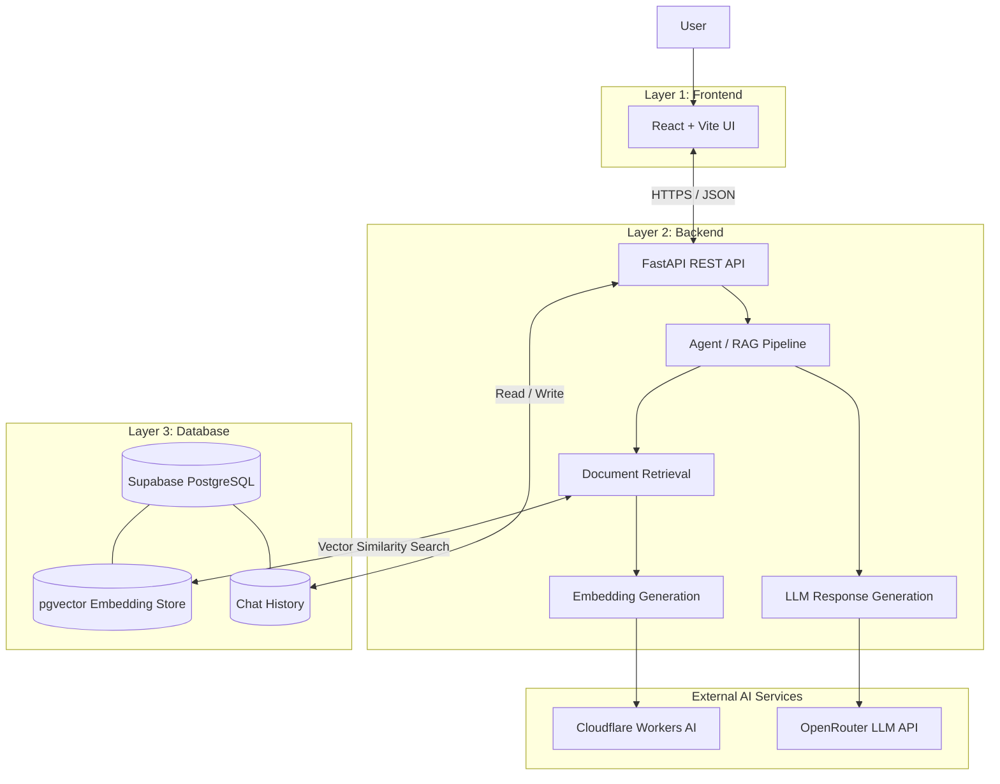

# Creozen GenAI — AI Research Paper Assistant

**An AI-powered research assistant that answers questions about scientific papers using Retrieval-Augmented Generation (RAG).**

Creozen GenAI retrieves relevant passages from a research-paper collection and generates context-grounded answers with supporting source references.

## Live Links

- **Frontend:** https://creozen-genai-project.vercel.app
- **Backend API:** https://creozen-genai-project.onrender.com
- **Backend Health:** https://creozen-genai-project.onrender.com/health
- **GitHub Repository:** https://github.com/RupeshO7a/creozen-genai-project

---

## 1. Project Overview

Research papers contain valuable technical information, but finding specific insights across lengthy documents can be time-consuming. Creozen GenAI allows users to ask natural-language questions and receive answers grounded in retrieved research content.

### Key Features

- AI-powered research assistance
- Retrieval-Augmented Generation (RAG)
- Semantic search using vector embeddings
- Context-grounded LLM responses
- Supporting source references
- REST API architecture
- Chat history persistence using Supabase
- Independently deployed frontend and backend
- Environment-based configuration for sensitive credentials

## 2. System Architecture

The application follows a three-layer architecture: Frontend, Backend, and Database. External AI services provide embeddings and language-model inference.



### Layer 1 — Frontend

**Technologies:** React, Vite, JavaScript, CSS

Responsibilities:

- Display the research assistant interface.
- Accept user questions.
- Send requests to the backend REST API.
- Display answers and source references.
- Manage user-interface state.

**Deployment:** Vercel

The frontend uses `VITE_API_URL` to identify the backend. Private AI service credentials and database keys are not placed in frontend code.

### Layer 2 — Backend

**Technologies:** Python, FastAPI, RAG, agent orchestration

Responsibilities:

- Expose REST API endpoints.
- Receive research questions.
- Generate query embeddings.
- Retrieve relevant research-paper passages.
- Coordinate retrieval and response generation.
- Call the configured LLM service.
- Return answers, sources, and processing information.
- Store and retrieve chat history.

**Deployment:** Render

The backend manages private credentials through environment variables.

### Layer 3 — Database

**Technologies:** Supabase PostgreSQL, pgvector

Responsibilities:

- Store research-document chunks.
- Store vector embeddings.
- Perform semantic similarity searches.
- Persist chat history.

### External AI Services

- **Cloudflare Workers AI:** Generates query embeddings using `@cf/qwen/qwen3-embedding-0.6b`.
- **OpenRouter:** Provides language-model inference through the configured `OPENROUTER_MODEL`.

These services are called by the backend rather than directly by the browser.

## 3. Technology Stack

| Component | Technology |
|---|---|
| Frontend | React, Vite, JavaScript |
| Backend | Python, FastAPI, Uvicorn |
| AI Architecture | Retrieval-Augmented Generation (RAG) |
| Agent Logic | Python application modules |
| Database | Supabase PostgreSQL |
| Vector Search | pgvector, PostgreSQL RPC |
| Embeddings | Cloudflare Workers AI |
| LLM Inference | OpenRouter |
| Frontend Hosting | Vercel |
| Backend Hosting | Render |
| Version Control | Git, GitHub |

## 4. Repository Structure

```text
creozen-genai-project/
├── backend/
│   ├── main.py
│   ├── llm.py
│   ├── rag.py
│   ├── agent.py
│   ├── tools.py
│   ├── requirements.txt
│   ├── .env.example
│   └── ...
├── frontend/
│   ├── src/
│   ├── public/
│   ├── package.json
│   ├── .env.example
│   └── ...
├── .gitignore
└── README.md
```

The frontend and backend are maintained in separate folders within the same Git repository.

## 5. Request and Data Flow

1. The user submits a question through the React frontend.
2. The frontend sends an HTTP request to the FastAPI backend.
3. The backend generates an embedding for the question using Cloudflare Workers AI.
4. The retrieval module searches Supabase for relevant document chunks.
5. The agent combines the question with the retrieved context.
6. The backend sends the prepared request to the configured OpenRouter model.
7. The backend returns the answer and supporting source information.
8. The frontend displays the response.
9. Chat history is stored in Supabase when the relevant backend operation succeeds.

## 6. Prerequisites

Install the following before running the project locally:

- Python 3.11 or a version compatible with the backend dependencies
- Node.js and npm
- Git
- A Supabase project with the required tables and vector-search function
- A Cloudflare account with Workers AI access
- An OpenRouter API key

Valid credentials are required for the complete AI workflow.

## 7. Local Installation and Setup

### Step 1 — Clone the Repository

```bash
git clone https://github.com/RupeshO7a/creozen-genai-project.git
cd creozen-genai-project
```

### Step 2 — Set Up the Backend

```powershell
cd backend
python -m venv venv
.\venv\Scripts\Activate.ps1
pip install -r requirements.txt
Copy-Item .env.example .env
```

Open `backend/.env` and replace the placeholders with your actual credentials.

```env
# Supabase
SUPABASE_URL=https://your-project-id.supabase.co
SUPABASE_SERVICE_KEY=your_supabase_service_role_key

# OpenRouter
OPENROUTER_API_KEY=your_openrouter_api_key
OPENROUTER_MODEL=openrouter/free

# Cloudflare Workers AI
CLOUDFLARE_ACCOUNT_ID=your_cloudflare_account_id
CLOUDFLARE_API_TOKEN=your_cloudflare_api_token
CLOUDFLARE_EMBED_MODEL=@cf/qwen/qwen3-embedding-0.6b

# CORS
ALLOWED_ORIGINS=http://localhost:5173,http://127.0.0.1:5173
```

Start the backend:

```bash
python -m uvicorn main:app --reload --port 8000
```

Backend endpoints:

- API root: http://localhost:8000/
- Health check: http://localhost:8000/health
- Interactive API documentation: http://localhost:8000/docs

The API documentation is available if it is enabled in the FastAPI application.

### Step 3 — Set Up the Frontend

Open a second terminal from the repository root.

```powershell
cd frontend
npm install
Copy-Item .env.example .env.development
```

Set the following in `frontend/.env.development`:

```env
VITE_API_URL=http://localhost:8000
```

Start the frontend:

```bash
npm run dev
```

Open the local URL printed by Vite, usually:

http://localhost:5173

Ensure the backend's `ALLOWED_ORIGINS` contains the exact frontend origin.

## 8. Environment Variables

### Backend Variables

| Variable | Purpose |
|---|---|
| `SUPABASE_URL` | Supabase project URL |
| `SUPABASE_SERVICE_KEY` | Backend database credential |
| `OPENROUTER_API_KEY` | OpenRouter authentication |
| `OPENROUTER_MODEL` | Configured LLM model |
| `CLOUDFLARE_ACCOUNT_ID` | Cloudflare account identifier |
| `CLOUDFLARE_API_TOKEN` | Cloudflare Workers AI authentication |
| `CLOUDFLARE_EMBED_MODEL` | Embedding model identifier |
| `ALLOWED_ORIGINS` | Comma-separated allowed frontend origins |

### Frontend Variables

| Variable | Purpose |
|---|---|
| `VITE_API_URL` | Base URL of the FastAPI backend |

**Security:** Vite exposes variables prefixed with `VITE_` to browser code. Only public configuration values, such as the backend URL, should use this prefix. Never place API keys, database passwords, or service-role credentials in frontend variables.

## 9. Database and Vector Search

The application uses Supabase PostgreSQL for application data and pgvector for semantic retrieval.

The database must contain the expected research-document chunks, compatible embeddings, and the PostgreSQL RPC function required by the backend.

The configured Cloudflare embedding model produces 1024-dimensional embeddings. The database vector column and retrieval function must support the same dimension.

Important requirements:

- Configure the Supabase URL and credentials.
- Ensure the PostgreSQL vector extension and required tables exist.
- Ensure the vector-search RPC function matches the backend's expected name and parameters.
- Ensure stored embeddings are compatible with the configured embedding model.
- Configure the chat-history table if chat history persistence is enabled.

Preserve existing database data when changing the vector schema or embedding configuration.

## 10. Deployment

### Frontend Deployment — Vercel

1. Import the GitHub repository into Vercel.
2. Set the root directory to `frontend`.
3. Select Vite as the framework preset.
4. Set the install command to `npm install`.
5. Set the build command to `npm run build`.
6. Set the output directory to `dist`.
7. Add the following environment variable:

```env
VITE_API_URL=https://creozen-genai-project.onrender.com
```

8. Deploy the project.

**Live frontend:** https://creozen-genai-project.vercel.app

### Backend Deployment — Render

1. Create a Web Service connected to the GitHub repository.
2. Set the root directory to `backend`.
3. Set the build command:

```bash
pip install -r requirements.txt
```

4. Set the start command:

```bash
uvicorn main:app --host 0.0.0.0 --port $PORT
```

5. Add all required backend environment variables in Render.
6. Set `ALLOWED_ORIGINS` to the deployed frontend origin:

```env
ALLOWED_ORIGINS=https://creozen-genai-project.vercel.app
```

7. Deploy and review the service logs.

**Live backend:** https://creozen-genai-project.onrender.com

**Health endpoint:** https://creozen-genai-project.onrender.com/health

Redeploy after changing environment variables when required so the running application uses the updated configuration.

> Render free-tier services may sleep after periods of inactivity, so the first request may take longer.

## 11. Git and Version Control

Frontend and backend source code are maintained in the same Git repository in separate folders.

**Repository:** https://github.com/RupeshO7a/creozen-genai-project

Typical Git workflow:

```bash
git status
git add .
git commit -m "Describe the changes"
git push origin main
```

Use meaningful commits to document progress, such as:

- `Add backend database and AI agent modules`
- `Implement vector retrieval pipeline`
- `Add research assistant frontend`
- `Prepare application for deployment`
- `Fix missing backend dependency`

Before committing, verify that `.gitignore` excludes:

- `.env` files containing real credentials
- Python virtual environments
- `node_modules`
- Build output
- Private research documents and other local-only data

Keep `.env.example` files in Git with placeholder values only.

## 12. Secret Management

The application separates configuration from source code through environment variables.

- Store local backend credentials in `backend/.env`.
- Configure production backend credentials in Render.
- Configure only public frontend variables in Vercel.
- Keep `.env.example` files free of real secrets.
- Never commit API keys, database credentials, or service-role keys.
- Rotate any credential that is accidentally exposed.

## 13. Troubleshooting

### Frontend Displays "Failed to fetch"

- Confirm the Render backend is running.
- Verify `VITE_API_URL` points to the correct Render backend URL.
- Confirm Render's `ALLOWED_ORIGINS` includes the exact Vercel frontend origin.
- Redeploy the frontend after changing environment variables.
- Inspect the browser developer console and network requests.

### Backend Returns an Error

- Review Render deployment and runtime logs.
- Verify all required environment variables are set.
- Check Supabase connectivity and database permissions.
- Verify Cloudflare and OpenRouter credentials and service availability.

### Retrieval Returns No Relevant Results

- Confirm research-document chunks exist in Supabase.
- Check that embedding dimensions are compatible.
- Verify the vector-search RPC function and parameters.
- Ensure query and document embeddings use compatible representations.

### Application Works Locally but Not in Production

- Compare local and production environment variable names.
- Confirm the latest code is deployed.
- Check CORS settings and production logs.
- Verify the database and external AI service configuration.

## 14. Future Improvements

Potential enhancements include:

- Uploading and processing research papers through the interface
- Supporting multiple research-paper collections
- Improving citation accuracy and source previews
- Adding user authentication and personalized sessions
- Introducing streaming responses
- Adding automated tests and continuous integration
- Improving observability and retrieval evaluation

## 15. Project Goals

Creozen GenAI demonstrates a modular AI application architecture that separates the user interface, backend processing, and persistent storage.

The project aims to:

- Make research papers easier to explore.
- Generate answers grounded in retrieved research context.
- Keep model inference and database operations behind a backend API.
- Enable semantic retrieval through vector search.
- Support independent frontend and backend deployments.
- Follow secure configuration and Git version-control practices.

---

**Built with React, FastAPI, Supabase, Cloudflare Workers AI, and OpenRouter.**

**GitHub:** https://github.com/RupeshO7a/creozen-genai-project

**Live Application:** https://creozen-genai-project.vercel.app
